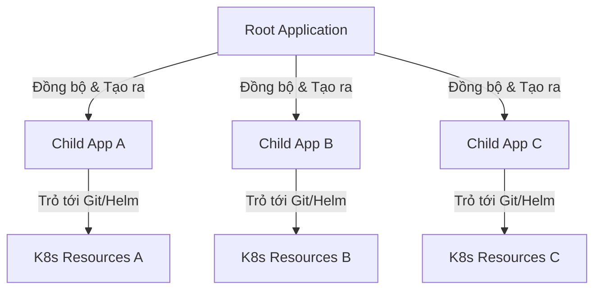

# So Sánh ArgoCD vs Flux CD & Các Design Patterns GitOps

Trong hệ sinh thái Kubernetes, **Argo CD** và **Flux CD** là hai công cụ GitOps (Continuous Delivery) phổ biến nhất hiện nay. Cả hai đều có nhiệm vụ đồng bộ trạng thái khai báo trong Git (Source of Truth) với trạng thái thực tế trong Kubernetes Cluster, tuy nhiên chúng có kiến trúc và cách tiếp cận rất khác nhau.

---

## 1. So Sánh Tổng Quan: Argo CD vs Flux CD

| Đặc tính | Argo CD | Flux CD |
| :--- | :--- | :--- |
| **Kiến trúc** | **Tập trung (Hub-and-Spoke)**: Một Argo CD server có thể quản lý nhiều cluster từ xa. | **Phân tán (Decentralized)**: Chạy dưới dạng các controller Kubernetes gốc trực tiếp trên từng cluster. |
| **Giao diện (UI)** | Có Web UI rất đẹp, trực quan, hỗ trợ xem trực tiếp tài nguyên, log, và thao tác sync thủ công. | Không có Web UI chính thức mặc định (chủ yếu qua CLI `flux` hoặc tích hợp UI bên thứ 3 như Weave GitOps). |
| **Cách quản lý** | Dựa trên CRD `Application` và `ApplicationSet` của Argo. | Chia nhỏ thành các Controller chuyên biệt (Source Controller, Kustomize Controller, Helm Controller). |
| **Cơ chế phân quyền (RBAC)** | Tích hợp sẵn SSO (Dex, OIDC) và phân quyền chi tiết (RBAC) trên UI. | Sử dụng Kubernetes RBAC gốc và cơ chế ServiceAccount. |
| **Độ phức tạp & Tài nguyên** | Nặng hơn, cần nhiều tài nguyên hơn để chạy Web UI và API Server. | Rất nhẹ, tối giản, đi theo triết lý "Kubernetes-native Unix tools". |

### Nên chọn công cụ nào?
*   **Chọn Argo CD nếu:** Bạn cần một giao diện trực quan cho các lập trình viên hoặc đội vận hành theo dõi trực tiếp, cần quản lý tập trung nhiều cluster từ một hub duy nhất, hoặc cần cơ chế phân quyền (RBAC) rõ ràng qua giao diện Web.
*   **Chọn Flux CD nếu:** Bạn thích triết lý Kubernetes-native (sử dụng YAML gốc, quản lý qua CLI), cần giải pháp cực nhẹ, bảo mật cao (không mở cổng Web UI), hoặc kiến trúc phân tán nơi mỗi cluster tự quản lý chính nó một cách độc lập.

---

## 2. Quản Lý Thứ Tự Triển Khai (Sync Waves vs DependsOn)

Khi triển khai các ứng dụng phức tạp, bạn cần đảm bảo một số tài nguyên phải được tạo trước (ví dụ: `Namespace`, `CustomResourceDefinition`, `ConfigMap`, Database) trước khi triển khai ứng dụng chính (`Deployment`, `StatefulSet`).

### a. Argo CD: Sync Waves (Sóng Đồng Bộ)
Argo CD sử dụng annotation `argocd.argoproj.io/sync-wave` để xác định thứ tự deploy các tài nguyên trong cùng một ứng dụng.
*   Các wave được biểu diễn bằng số nguyên (cả âm và dương). Mặc định là `0`.
*   Argo CD sẽ chạy từ wave thấp nhất đến wave cao nhất (ví dụ: `-5` -> `0` -> `5`).
*   **Điều kiện chuyển wave:** Argo CD chỉ chuyển sang wave tiếp theo khi toàn bộ tài nguyên ở wave hiện tại đã chuyển sang trạng thái **Healthy** (Ví dụ: Pod của DB đã Running và Ready).

**Ví dụ cấu hình Sync Wave:**
```yaml
# 1. Tạo Namespace trước (Wave -5)
apiVersion: v1
kind: Namespace
metadata:
  name: my-app
  annotations:
    argocd.argoproj.io/sync-wave: "-5"
---
# 2. Deploy Database sau đó (Wave 0)
apiVersion: apps/v1
kind: Deployment
metadata:
  name: db-deployment
  namespace: my-app
  annotations:
    argocd.argoproj.io/sync-wave: "0"
---
# 3. Deploy App chính cuối cùng (Wave 5)
apiVersion: apps/v1
kind: Deployment
metadata:
  name: web-app-deployment
  namespace: my-app
  annotations:
    argocd.argoproj.io/sync-wave: "5"
```

### b. Flux CD: `dependsOn` (Phụ Thuộc Tường Minh)
Flux quản lý thứ tự ở cấp độ cấu trúc dữ liệu của Custom Resource (CRD) thông qua trường `dependsOn` trong các định nghĩa `Kustomization` hoặc `HelmRelease`.
*   Đây là cách tiếp cận mang tính mô-đun hơn. Thay vì đánh dấu từng file lẻ tẻ bằng annotation, Flux định nghĩa sự phụ thuộc giữa các cụm tài nguyên lớn.

**Ví dụ cấu hình `dependsOn` trong Flux:**
```yaml
apiVersion: kustomize.toolkit.fluxcd.io/v1
kind: Kustomization
metadata:
  name: backend-app
  namespace: flux-system
spec:
  interval: 10m
  dependsOn:
    - name: database-infra # Chỉ deploy backend sau khi database-infra đã Ready
  path: ./apps/backend
  prune: true
  sourceRef:
    kind: GitRepository
    name: flux-system
```

---

## 3. Quản Lý Multi-App: "App of Apps" Pattern

Khi số lượng ứng dụng tăng lên, việc khai báo thủ công từng Application trên Argo CD hoặc Flux sẽ rất cồng kềnh. Mẫu thiết kế **App of Apps** sinh ra để giải quyết vấn đề này.

### a. Argo CD "App of Apps"
Ý tưởng là tạo ra một ứng dụng Argo CD "gốc" (Root Application), ứng dụng này không chứa code của app thật mà chỉ chứa định nghĩa khai báo của các ứng dụng Argo CD "con" (Child Applications).



**Ví dụ cấu hình Root Application (`root-app.yaml`):**
```yaml
apiVersion: argoproj.io/v1alpha1
kind: Application
metadata:
  name: root-application
  namespace: argocd
spec:
  project: default
  source:
    repoURL: 'https://github.com/my-org/gitops-infra.git'
    targetRevision: HEAD
    path: apps-configurations # Thư mục chứa các file YAML của các Child Apps
  destination:
    server: 'https://kubernetes.default.svc'
    namespace: argocd
  syncPolicy:
    automated:
      prune: true
      selfHeal: true
```
Khi bạn apply file `root-app.yaml` này, Argo CD sẽ quét thư mục `apps-configurations` trên Git và tự động sinh ra/quản lý tất cả các ứng dụng con được định nghĩa trong đó.

### b. Flux CD: Composable Kustomizations
Flux không có khái niệm "App of Apps" cụ thể nhưng đạt được kết quả tương tự bằng cách lồng ghép các tệp cấu hình `Kustomization`.
Một `Kustomization` gốc sẽ trỏ tới thư mục chứa các file `Kustomization` con khác. Flux sẽ tự động phân tích và đồng bộ tất cả chúng theo dạng cây thư mục.
