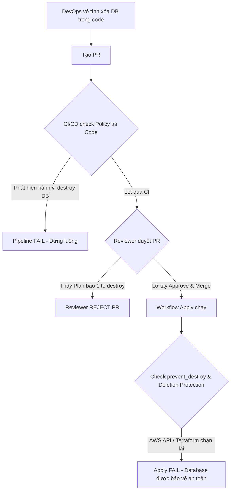

# Hỏi Đáp & Kinh Nghiệm Thực Tế về Terraform GitOps

Tài liệu này tổng hợp các câu hỏi thực tế và phương pháp bảo vệ hạ tầng quan trọng rút ra trong quá trình thực hành luồng CI/CD cho Terraform.

---

## I. Giải Đáp Thắc Mắc Kỹ Thuật

### Q1: Tại sao phải chạy `terraform init` ở cả hai workflow (Plan on PR và Apply on Merge)?
1. **Runner của CI/CD là Stateless & Ephemeral (Không lưu trạng thái):**
   * Mỗi workflow (Plan hoặc Apply) được chạy trên một máy ảo/container hoàn toàn mới tinh do GitHub cấp phát.
   * Khi kết thúc job, máy ảo đó bị hủy ngay lập tức. Do đó, máy ảo chạy Apply không thừa hưởng được thư mục `.terraform` (chứa provider và backend config) từ máy ảo chạy Plan trước đó, bắt buộc phải chạy `init` lại từ đầu.
2. **Ngăn ngừa thay đổi Codebase:**
   * Từ lúc bạn tạo PR cho đến lúc merge, nhánh `main` có thể đã được cập nhật thêm provider hoặc module mới. Chạy `init` ở nhánh main lúc merge đảm bảo các cấu hình mới nhất được tải về chính xác.
3. **Tính nhất quán và Bảo mật:**
   * Khởi tạo từ môi trường sạch giúp loại bỏ các lỗi do cache cũ và các nguy cơ bảo mật từ code không an toàn trong PR.

---

### Q2: Chạy `terraform init` có tự động đưa file state lên S3 hay phải đợi `apply`?
* **Trường hợp dự án mới:** `terraform init` chỉ kết nối và cấu hình backend. Chưa có file state nào được tạo trên S3. Chỉ khi chạy `terraform apply` thành công lần đầu tiên, file state mới được ghi nhận và lưu lên S3.
* **Trường hợp di chuyển (Migration):** Nếu dự án đã chạy ở local và có file state cục bộ (`terraform.tfstate`), khi cấu hình backend S3 rồi chạy `terraform init`, Terraform sẽ hỏi bạn có muốn chuyển (migrate) file state cũ lên S3 không. Nếu chọn **yes**, file state sẽ được upload ngay.

---

### Q3: Có bắt buộc phải chạy `terraform init` dưới local trước khi đưa lên CI/CD không?
* **Không bắt buộc.** Chỉ cần S3 bucket lưu state đã được tạo sẵn trước đó (ví dụ tạo bằng tay trên Cloud Console), bạn chỉ cần cấu hình backend trong code rồi push lên. 
* Hệ thống CI/CD trên GitHub Actions sẽ tự động chạy `terraform init` để kết nối vào S3 bucket trống này, rồi chạy `terraform apply` để tự tạo file state lần đầu tiên.

---

## II. Các Lớp Bảo Vệ Hạ Tầng Thực Tế (Anti-Accidental Destruction)

Để tránh việc DevOps vô tình hoặc cố ý xóa các tài nguyên quan trọng (Database, Network, v.v.), doanh nghiệp áp dụng mô hình phòng thủ nhiều lớp (**Defense-in-depth**):

### Lớp 1: Rào cản quy trình trên GitHub (Process Guardrails)
* **Branch Protection:** Cấu hình nhánh `main` bắt buộc phải được review và approve bởi ít nhất 1-2 người khác mới được phép merge. Ngăn chặn việc tự tạo code tự merge.
* **CODEOWNERS:** Thiết lập tệp chỉ định cụ thể nhóm chuyên gia (DBA, Security Team) bắt buộc phải phê duyệt nếu PR có chỉnh sửa trong các thư mục hạ tầng quan trọng (ví dụ: `/terraform/database/`).

### Lớp 2: Bảo vệ bằng thuộc tính Lifecycle (`prevent_destroy`)
Sử dụng cấu hình lifecycle trực tiếp trong code Terraform của tài nguyên quan trọng:
```hcl
resource "aws_db_instance" "production_db" {
  # ... các cấu hình khác ...

  lifecycle {
    prevent_destroy = true # Ngăn chặn hoàn toàn hành động hủy tài nguyên này
  }
}
```
* **Cách hoạt động:** Nếu có ai đó vô tình xóa khối code này hoặc thay đổi một thuộc tính buộc phải tạo lại resource (gây ra hành vi destroy), lệnh `terraform plan` sẽ báo lỗi ngay lập tức và dừng pipeline lại.

### Lớp 3: Khóa xóa phía Cloud Provider (Deletion Protection)
Kích hoạt tính năng chống xóa trực tiếp trên Cloud (hỗ trợ bởi RDS, S3, DynamoDB, ALBs,...):
```hcl
resource "aws_db_instance" "production_db" {
  # ... các cấu hình khác ...

  deletion_protection = true # Khóa xóa ở cấp độ AWS API
}
```
* **Cách hoạt động:** Dù Terraform có gửi lệnh xóa được duyệt từ code, AWS API vẫn sẽ từ chối và báo lỗi. Muốn xóa, quản trị viên phải đăng nhập vào Console hoặc dùng CLI để tắt tính năng này bằng tay trước.

### Lớp 4: Kiểm tra chính sách tự động (Policy as Code)
Tích hợp các công cụ quét chính sách tự động như **OPA (Open Policy Agent)**, **Checkov**, hoặc **Sentinel** vào pipeline CI/CD:
* Quét file JSON kết quả của `terraform plan`.
* Viết luật tự động: *"Nếu phát hiện bất kỳ hành động xóa (destroy) nào đối với các tài nguyên loại `aws_db_instance` hoặc `aws_s3_bucket`, hãy lập tức đánh sập (Fail) pipeline."*

---

## Sơ đồ luồng xử lý lỗi an toàn:


