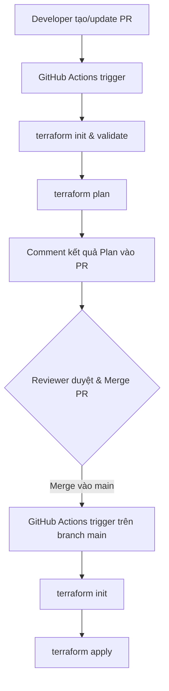

# GitHub Actions: Plan-on-PR & Apply-on-Merge Flow

Mô hình **"Plan on PR, Apply on Merge"** (Lập kế hoạch khi tạo Pull Request, Áp dụng khi Merge) là một best practice tiêu chuẩn khi triển khai hạ tầng dưới dạng mã (IaC - Infrastructure as Code), đặc biệt là với **Terraform/OpenTofu**, sử dụng GitHub Actions.

---

## 1. Luồng hoạt động cốt lõi (Core Workflow)



### Bước 1: Lập kế hoạch khi tạo PR (Plan on PR)
- **Kích hoạt:** Khi có PR mới hoặc cập nhật commit trên PR hướng về nhánh chính (`main`/`master`).
- **Nhiệm vụ:**
  1. Kiểm tra định dạng (`terraform fmt -check`).
  2. Kiểm tra tính hợp lệ của cú pháp (`terraform validate`).
  3. Chạy `terraform plan` để xem các tài nguyên sẽ bị thay đổi (Add, Change, Destroy).
- **Phản hồi:** Đưa kết quả `plan` chi tiết (hoặc tóm tắt) làm bình luận (comment) trực tiếp trên giao diện PR. Điều này giúp các Reviewer dễ dàng đánh giá tác động trước khi phê duyệt.

### Bước 2: Áp dụng khi Merge (Apply on Merge)
- **Kích hoạt:** Khi PR được phê duyệt và chính thức merge vào nhánh chính.
- **Nhiệm vụ:**
  1. Chạy `terraform apply -auto-approve` để áp dụng thực tế các thay đổi lên môi trường Cloud.
- **Lưu ý:** Tuyệt đối không cho phép chạy `apply` trực tiếp từ nhánh cá nhân hoặc khi chưa được review.

---

## 2. Các Best Practices Quan Trọng

### a. Bảo mật thông tin xác thực (OIDC - OpenID Connect)
*   **Vấn đề:** Không nên lưu trữ thông tin đăng nhập dài hạn (như AWS Access Keys, Azure Service Principal Client Secrets) trong GitHub Secrets vì dễ rò rỉ và khó xoay vòng (rotate).
*   **Giải pháp:** Sử dụng **OIDC** (ví dụ: AWS IAM Role Trust hoặc GCP Workload Identity Federation). GitHub Actions sẽ tự động trao đổi mã token ngắn hạn của nó lấy quyền truy cập Cloud tạm thời để thực thi mã Terraform.

### b. Quản lý tệp Plan tránh bị Lỗi thời (Stale Plan)
*   **Vấn đề:** Nếu PR được tạo cách đây vài ngày và trong thời gian đó có một PR khác đã merge làm thay đổi hạ tầng, tệp plan cũ của PR hiện tại sẽ bị lỗi thời (stale). Nếu apply có thể gây lỗi hoặc ghi đè hạ tầng cũ.
*   **Giải pháp:**
    1.  Cấu hình GitHub yêu cầu nhánh PR phải **Up-to-date** với nhánh chính trước khi merge.
    2.  Sử dụng cơ chế lưu trữ plan file dưới dạng **Artifact** được mã hóa (encrypted artifact) trong bước PR, sau đó tải xuống và apply chính xác file đó ở bước Merge.

### c. Chống xung đột State (Concurrency & State Lock)
*   Terraform sử dụng cơ chế khóa trạng thái (State Locking - ví dụ qua AWS DynamoDB) để ngăn hai tiến trình thay đổi hạ tầng cùng lúc.
*   Trong GitHub Actions, sử dụng thuộc tính `concurrency` trong YAML để giới hạn chỉ cho phép một workflow chạy `apply` tại một thời điểm:
    ```yaml
    concurrency:
      group: terraform-${{ github.ref }}
      cancel-in-progress: false
    ```

### d. Phát hiện trôi lệch cấu hình (Drift Detection)
*   Thực tế có thể có ai đó sửa hạ tầng trực tiếp trên Cloud Web Console (vượt mặt Terraform).
*   **Giải pháp:** Thiết lập một workflow chạy định kỳ (cron job hàng ngày) để chạy `terraform plan`. Nếu phát hiện có sự khác biệt (drift) giữa thực tế và code, workflow sẽ gửi cảnh báo (Slack, Email) để đội ngũ kịp thời sửa đổi.

---

## 3. Cấu hình GitHub Actions mẫu (Tham khảo)

Dưới đây là khung cấu hình đơn giản chia làm 2 giai đoạn:

```yaml
name: Terraform CI/CD

on:
  pull_request:
    branches:
      - main
    paths:
      - 'terraform/**'
  push:
    branches:
      - main
    paths:
      - 'terraform/**'

permissions:
  id-token: write # Cần thiết để lấy token OIDC
  contents: read
  pull-requests: write # Để comment kết quả plan lên PR

jobs:
  terraform:
    runs-on: ubuntu-latest
    defaults:
      run:
        working-directory: ./terraform
    steps:
      - name: Checkout Code
        uses: actions/checkout@v4

      - name: Configure Cloud Credentials (OIDC)
        uses: aws-actions/configure-aws-credentials@v4
        with:
          role-to-assume: arn:aws:iam::123456789012:role/github-actions-terraform
          aws-region: us-east-1

      - name: Setup Terraform
        uses: hashicorp/setup-terraform@v3

      - name: Terraform Init
        run: terraform init

      - name: Terraform Format & Validate
        run: |
          terraform fmt -check
          terraform validate

      # CHẠY PLAN KHI CÓ PULL REQUEST
      - name: Terraform Plan
        if: github.event_name == 'pull_request'
        id: plan
        run: terraform plan -no-color

      # COMMENT KẾT QUẢ VÀO PR
      - name: Update Pull Request Comment
        uses: actions/github-script@v7
        if: github.event_name == 'pull_request'
        with:
          script: |
            const output = `#### Terraform Plan Status: ✅ Success
            
            <details><summary>Show Plan</summary>
            
            \`\`\`hcl
            ${process.env.PLAN}
            \`\`\`
            
            </details>`;
            github.rest.issues.createComment({
              issue_number: context.issue.number,
              owner: context.repo.owner,
              repo: context.repo.repo,
              body: output
            })

      # CHẠY APPLY KHI MERGE VÀO MAIN
      - name: Terraform Apply
        if: github.ref == 'refs/heads/main' && github.event_name == 'push'
        run: terraform apply -auto-approve
