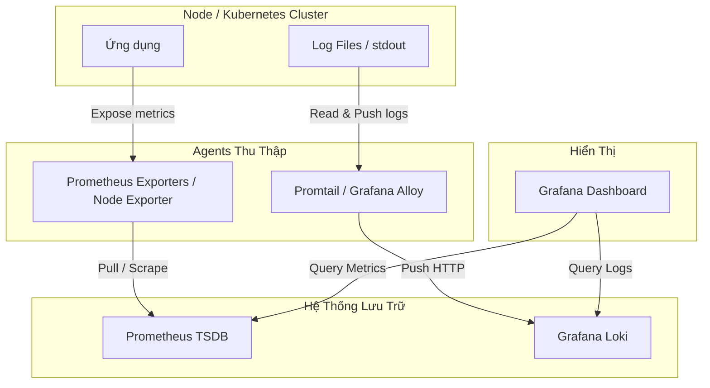

# Bộ Ba Prometheus, Grafana & Loki: Giám Sát Metrics và Logs Toàn Diện

Để có cái nhìn toàn diện về sức khỏe của hệ thống, một kỹ sư DevOps cần kết hợp cả **Metrics** (hệ thống đang hoạt động thế nào - Prometheus) và **Logs** (chi tiết chuyện gì đang xảy ra bên trong - Loki), sau đó hiển thị chúng trên một giao diện hợp nhất (**Grafana**). 

Hệ sinh thái này thường được gọi là **PLG Stack** (Prometheus - Loki - Grafana).

---

## 1. Kiến Trúc Hoạt Động Của PLG Stack

Sự ăn ý của bộ ba này nằm ở **mô hình chia sẻ nhãn (Label-based metadata model)**. Loki được thiết kế để sử dụng cấu trúc nhãn giống hệt Prometheus, giúp việc đối chiếu chéo (correlate) giữa metric và log diễn ra ngay lập tức.



*   **Prometheus:** Đi theo mô hình **Pull**. Nó chủ động gửi request định kỳ tới các ứng dụng/exporters để cào (scrape) dữ liệu metric.
*   **Loki:** Đi theo mô hình **Push**. Các agent thu gom logs (như Promtail hoặc Alloy) chạy trên máy chủ sẽ liên tục đọc file log và đẩy (push) về Loki.
*   **Grafana:** Truy vấn dữ liệu từ cả hai nguồn trên để vẽ biểu đồ và hiển thị danh sách log.

---

## 2. Cấu Hình Thu Thập Metrics & Logs

### a. Cấu hình Prometheus Scrape Job (`prometheus.yml`)
Dưới đây là cấu hình Prometheus để cào metrics từ ứng dụng (ví dụ: chạy ở cổng `8080`) và gán nhãn nhận diện.

```yaml
global:
  scrape_interval: 15s # Chu kỳ cào dữ liệu mặc định

scrape_configs:
  # Cào metrics hệ thống của chính Prometheus
  - job_name: 'prometheus'
    static_configs:
      - targets: ['localhost:9090']

  # Cào metrics từ ứng dụng Node.js/Go
  - job_name: 'api-service'
    metrics_path: '/metrics'
    static_configs:
      - targets: ['api-service-dns:8080']
        labels:
          env: 'production'
          app: 'gateway'
          tier: 'backend'
```

### b. Cấu hình Promtail Thu Gom Logs (`promtail-config.yml`)
Promtail cần biết file log nằm ở đâu và gán các nhãn (labels) tương ứng trước khi đẩy lên Loki. Nhãn này cần **trùng khớp** với nhãn của Prometheus để dễ dàng đối chiếu.

```yaml
server:
  http_listen_port: 9080
  grpc_listen_port: 0

positions:
  filename: /tmp/positions.yaml # Lưu lại vị trí dòng log cuối cùng đã đọc để tránh đọc trùng khi restart

clients:
  - url: http://loki:3100/loki/api/v1/push

scrape_configs:
  - job_name: local-system-logs
    static_configs:
      - targets: [localhost]
        labels:
          # Các nhãn dùng để phân loại và truy vấn
          job: varlogs
          env: production
          __path__: /var/log/*.log # Đường dẫn thu thập log hệ thống

  - job_name: app-container-logs
    static_configs:
      - targets: [localhost]
        labels:
          job: api-service
          env: production
          app: gateway
          tier: backend
          __path__: /var/log/apps/api-service/*.log # Log của ứng dụng
```

---

## 3. Liên Kết (Correlation) Metrics và Logs Trên Grafana

Sức mạnh thực sự của PLG Stack xuất hiện khi bạn cấu hình **Data Source Correlation** hoặc sử dụng tính năng **Explore** trên Grafana.

### Cách thức hoạt động của tính năng "Jumping to Logs"
Khi bạn phát hiện một điểm nhọn hoắt (spike) bất thường trên biểu đồ CPU hay tỷ lệ HTTP 5xx của Prometheus:
1.  Nhấp vào điểm đồ thị đó trên Grafana.
2.  Grafana sẽ hiển thị tùy chọn **"Explore logs"** (hoặc nút **Split View**).
3.  Nhờ việc cấu hình nhãn trùng khớp (`env="production"`, `app="gateway"`), Grafana tự động dịch câu lệnh Prometheus thành câu lệnh LogQL tương ứng:
    *   *PromQL:* `sum(rate(http_requests_total{status=~"5.."}[5m])) by (app)`
    *   *LogQL tương đương:* `{app="gateway", env="production"} |= "error"`
4.  Bạn có thể đọc ngay các dòng log lỗi xảy ra đúng vào phần nghìn giây đó mà không cần phải chuyển tab gõ tìm kiếm thủ công.

```
+-------------------------------------------------------------+
| Grafana Split Screen                                        |
| [ METRICS (Prometheus) ]      | [ LOGS (Loki) ]             |
| 10 |      /\                  | 12:00:01 [ERROR] DB Timeout |
|  5 | ____/  \____             | 12:00:02 [WARN] Retry connection|
|  0 +-------------             | 12:00:03 [ERROR] Request failed |
|    11:58   12:00   12:02      |                             |
+-------------------------------------------------------------+
```

### Cách thiết lập "Derived Fields" trong Grafana để Trace Logs liên kết
Nếu ứng dụng của bạn có ghi log kèm theo `trace_id` (từ OpenTelemetry), bạn có thể cấu hình Loki Data Source trong Grafana để biến chuỗi `trace_id` trong log thành một **link clickable** dẫn thẳng sang hệ thống phân tích Trace (như Grafana Tempo hay Jaeger):

1.  Vào **Grafana -> Administration -> Data sources -> Loki**.
2.  Tìm phần **Derived fields**.
3.  Thêm một trường mới:
    *   **Name:** `TraceID`
    *   **Regex:** `trace_id=(\w+)`
    *   **URL:** `https://your-grafana/explore?left=%5B%22now-1h%22,%22now%22,%22Tempo%22,%7B%22query%22:%22${__value.raw}%22%7D%5D` (Đường dẫn Explore của Tempo sử dụng Trace ID làm biến truy vấn).

---

## 4. Tại Sao Loki Lại Tiết Kiệm Chi Phí Hơn Elasticsearch?

Nhiều doanh nghiệp chuyển đổi từ ELK Stack (Elasticsearch) sang PLG Stack vì lý do chi phí vận hành hạ tầng lưu trữ log:

| Tiêu chí | Elasticsearch / OpenSearch | Grafana Loki |
| :--- | :--- | :--- |
| **Cách thức Index** | Full-text Indexing (Lập chỉ mục toàn bộ nội dung của mọi dòng log)[6]. | Label-only Indexing (Chỉ lập chỉ mục các nhãn siêu dữ liệu - metadata labels)[3][6]. |
| **Dung lượng lưu trữ** | Lớn (chỉ mục có thể chiếm tới 40-100% dung lượng log thô). | Cực kỳ nhỏ (chỉ mục chỉ chiếm khoảng 1-5% dung lượng log thô). |
| **Phần cứng yêu cầu** | Tốn rất nhiều RAM/CPU để duy trì các index lớn chạy ổn định. | Rất nhẹ, tận dụng Object Storage rẻ tiền (AWS S3, Google Cloud Storage) để lưu log chunks[3]. |
| **Tốc độ tìm kiếm** | Cực kỳ nhanh khi tìm kiếm các từ khóa ngẫu nhiên trong nội dung log thô. | Nhanh khi tìm kiếm dựa trên nhãn lọc trước, nhưng có thể chậm hơn nếu quét chuỗi thô trên lượng log khổng lồ. |
