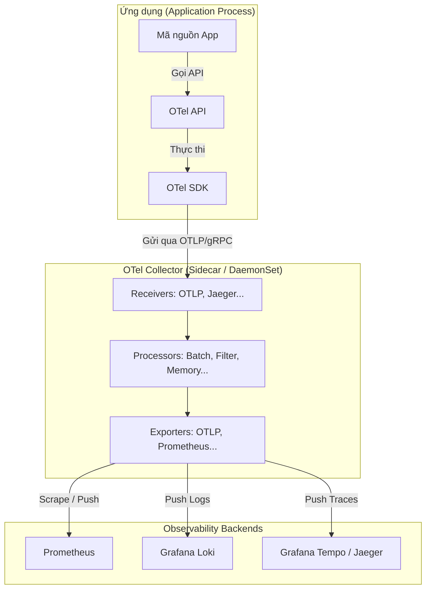

# OpenTelemetry SDK & Collector: Kiến Trúc và Thực Tế Cấu Hình

Trong kỷ nguyên microservices và cloud-native, việc thu thập dữ liệu giám sát (Metrics, Traces, Logs - hay còn gọi là **M.E.L.T**) từ nhiều nguồn khác nhau trở thành một thách thức lớn. **OpenTelemetry (OTel)** ra đời như một tiêu chuẩn mở toàn cầu giúp hợp nhất và chuẩn hóa quy trình này.

Để triển khai OpenTelemetry hiệu quả, ta cần hiểu rõ hai thành phần cốt lõi: **OTel SDK** (nằm bên trong ứng dụng) và **OTel Collector** (nằm bên ngoài ứng dụng).

---

## 1. Kiến Trúc OpenTelemetry: SDK vs Collector

Mô hình hoạt động tiêu chuẩn của OpenTelemetry phân chia rõ ràng trách nhiệm giữa việc **sinh dữ liệu (SDK)** và **xử lý/chuyển tiếp dữ liệu (Collector)**.



### a. OpenTelemetry SDK (Phần mềm nhúng)
*   **Vị trí:** Chạy trực tiếp bên trong tiến trình (process) của ứng dụng như một thư viện (library/dependency).
*   **Trách nhiệm:** 
    *   **Instrumentation (Đo đạc):** Cung cấp các thư viện tự động (Auto-instrumentation) hoặc API để lập trình viên tự ghi nhận mã (Manual instrumentation).
    *   **Context Propagation:** Truyền dữ liệu ngữ cảnh (ví dụ: `traceparent` header) qua các cuộc gọi HTTP/gRPC giữa các microservices nhằm liên kết các span lại với nhau.
    *   **Basic Processing & Exporting:** Đóng gói (batching) sơ bộ và đẩy dữ liệu ra ngoài qua giao thức **OTLP** (OpenTelemetry Protocol).

### b. OpenTelemetry Collector (Trạm trung chuyển)
*   **Vị trí:** Chạy độc lập ngoài ứng dụng (thường dưới dạng Sidecar container, DaemonSet trong Kubernetes, hoặc một Gateway tập trung).
*   **Trách nhiệm:** Nhận dữ liệu từ nhiều nguồn, tiền xử lý (lọc, gom nhóm, ẩn thông tin nhạy cảm), và phân phối tới các hệ thống lưu trữ đích (Backends).
*   **Tại sao cần Collector?**
    *   **Giảm tải cho App:** Ứng dụng chỉ cần đẩy nhanh dữ liệu qua OTLP nội bộ (local), việc retry, nén, gom lô (batching) nặng nhọc sẽ do Collector gánh vác.
    *   **Bảo mật:** Không cần nhét thông tin credentials/token của các Backend (như Datadog, Grafana Cloud) vào mã nguồn hay môi trường chạy của App. Chỉ cần cấu hình chúng ở Collector.
    *   **Linh hoạt:** Thay đổi backend lưu trữ chỉ bằng cách sửa file config của Collector mà không cần sửa code hay deploy lại ứng dụng.

---

## 2. Cách thiết lập OTel SDK trong ứng dụng (Ví dụ Node.js)

Để thu thập metrics và traces từ ứng dụng, ta nhúng OTel SDK. Dưới đây là ví dụ cấu hình chuẩn cho một ứng dụng Node.js sử dụng Express:

```javascript
// sdk.js - Khởi tạo OTel SDK trước khi load bất kỳ code ứng dụng nào khác
const opentelemetry = require('@opentelemetry/sdk-node');
const { getNodeAutoInstrumentations } = require('@opentelemetry/auto-instrumentations-node');
const { OTLPTraceExporter } = require('@opentelemetry/exporter-trace-otlp-grpc');
const { OTLPMetricExporter } = require('@opentelemetry/exporter-metrics-otlp-grpc');
const { PeriodicExportingMetricReader } = require('@opentelemetry/sdk-metrics');

// 1. Cấu hình Exporters để đẩy dữ liệu về OTel Collector local (localhost:4317)
const traceExporter = new OTLPTraceExporter({
  url: 'grpc://localhost:4317', 
});

const metricExporter = new OTLPMetricExporter({
  url: 'grpc://localhost:4317',
});

// 2. Khởi tạo SDK
const sdk = new opentelemetry.NodeSDK({
  serviceName: 'order-service', // Tên dịch vụ hiển thị trên dashboard
  traceExporter: traceExporter,
  metricReader: new PeriodicExportingMetricReader({
    exporter: metricExporter,
    exportIntervalMillis: 60000, // Gửi metric mỗi 60 giây
  }),
  instrumentations: [getNodeAutoInstrumentations()], // Tự động đo đạc HTTP, Express, gRPC, DB...
});

// 3. Khởi động SDK và đăng ký shutdown hook
sdk.start();

process.on('SIGTERM', () => {
  sdk.shutdown()
    .then(() => console.log('SDK shut down successfully'))
    .catch((error) => console.log('Error shutting down SDK', error))
    .finally(() => process.exit(0));
});
```

---

## 3. Cấu hình OTel Collector Pipeline

OTel Collector hoạt động dựa trên một file cấu hình YAML (`config.yaml`), được chia làm 4 thành phần chính cấu thành nên **Pipeline**:

1.  **Receivers (Nhận đầu vào):** Định nghĩa các giao thức và cổng nhận dữ liệu (ví dụ: OTLP gRPC/HTTP, Prometheus, Zipkin).
2.  **Processors (Tiền xử lý):** Xử lý dữ liệu nhận được (ví dụ: `batch` để gom lô giảm tải, `memory_limiter` tránh tràn RAM, `filter` lọc dữ liệu rác).
3.  **Exporters (Xuất đầu ra):** Nơi gửi dữ liệu đi (ví dụ: gửi tới Prometheus, Jaeger, Loki, Tempo hoặc OTLP Gateway khác).
4.  **Connectors (Liên kết - Tùy chọn):** Kết nối các pipeline khác nhau lại.

### File cấu hình ví dụ chuẩn (`otel-collector-config.yaml`)

```yaml
receivers:
  # Nhận dữ liệu chuẩn OpenTelemetry (OTLP) qua cả gRPC và HTTP
  otlp:
    protocols:
      grpc:
        endpoint: 0.0.0.0:4317
      http:
        endpoint: 0.0.0.0:4318

processors:
  # Tránh tình trạng Collector ngốn quá nhiều tài nguyên RAM của hệ thống
  memory_limiter:
    check_interval: 1s
    limit_percentage: 75
    spike_limit_percentage: 15

  # Gom các spans/metrics lại rồi mới gửi đi để tối ưu băng thông và giảm HTTP overhead
  batch:
    send_batch_size: 8192
    timeout: 5s
    send_batch_max_size: 10240

exporters:
  # Xuất traces sang Grafana Tempo / Jaeger qua OTLP gRPC
  otlp/tempo:
    endpoint: tempo:4317
    tls:
      insecure: true

  # Xuất metrics ra định dạng Prometheus để Prometheus Server có thể vào cào (scrape)
  prometheus:
    endpoint: 0.0.0.0:8889
    namespace: otel

  # Xuất logs sang Grafana Loki
  loki:
    endpoint: http://loki:3100/loki/api/v1/push

service:
  pipelines:
    traces:
      receivers: [otlp]
      processors: [memory_limiter, batch]
      exporters: [otlp/tempo]

    metrics:
      receivers: [otlp]
      processors: [memory_limiter, batch]
      exporters: [prometheus]

    logs:
      receivers: [otlp]
      processors: [memory_limiter, batch]
      exporters: [loki]

  telemetry:
    logs:
      level: "info"
```

---

## 4. So sánh hai mô hình triển khai Collector

| Đặc điểm | Agent / Sidecar Pattern | Gateway / Cluster Pattern |
| :--- | :--- | :--- |
| **Bố trí** | Chạy cạnh từng instance của ứng dụng (trong cùng Pod hoặc VM)[9]. | Chạy độc lập như một cụm chịu tải lớn cho toàn Cluster[9]. |
| **Ưu điểm** | App giao tiếp local cực nhanh, ít trễ. Tự động thu thập system metrics của Host dễ dàng[5]. | Quản lý tập trung cấu hình, dễ scale riêng biệt, chịu tải tốt[9]. |
| **Nhược điểm** | Quản lý nhiều bản sao cấu hình. Tốn RAM nếu chạy quá nhiều sidecar[9]. | Thêm một chặng mạng trung gian (Network Hop) làm tăng trễ nhẹ[8]. |

> [!TIP]
> **Khuyến nghị thực tế:** Sử dụng mô hình **kết hợp (Hybrid)**. Mỗi Pod chạy một Collector Agent ở dạng Sidecar để tiếp nhận dữ liệu nhanh từ App, sau đó các Agent này chuyển tiếp (forward) dữ liệu về một cụm **Collector Gateway** tập trung để xử lý lọc, gán nhãn nâng cao rồi mới đẩy đi các backend.
