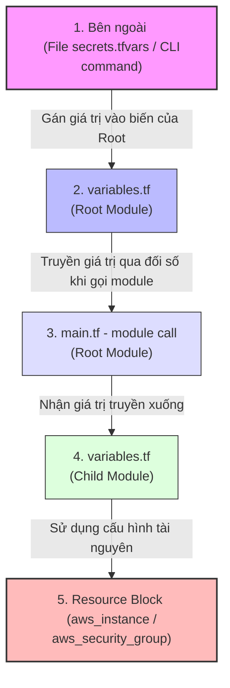

# Phạm Vi Biến (Scope) & Tính Đóng Gói (Encapsulation) Trong Terraform Modules

Tài liệu này giải thích chi tiết lý do tại sao trong Terraform, một số biến cần phải định nghĩa lại ở cả **Root Module** (thư mục chính) và **Child Module** (module con), kèm theo nguyên lý truyền dữ liệu và các trường hợp ngoại lệ.

---

## 1. Nguyên Lý Thiết Kế: Tính Đóng Gói (Encapsulation)

Trong Terraform, mỗi module hoạt động như một **hộp đen độc lập (isolated namespace)**. 
* **Child Module** không thể tự ý đọc các biến được khai báo ở Root Module.
* **Root Module** cũng không thể tự ý truy cập các biến nội bộ của Child Module.

### Phép liên tưởng lập trình: Module giống như một "Hàm" (Function)
* **Child Module (Ví dụ: `custom-ec2`):** Tương đương với việc bạn định nghĩa một **Hàm** trong lập trình. File `variables.tf` của Child Module chính là các **Tham số đầu vào của hàm** (Parameters).
* **Root Module:** Tương đương với **Chương trình chính** gọi hàm đó chạy. File `variables.tf` của Root Module chính là các **Tham số dòng lệnh** nhận giá trị nhập từ bàn phím hoặc file cấu hình bên ngoài.

---

## 2. Luồng Đi Của Dữ Liệu (Data Flow)

Để một giá trị cấu hình (ví dụ: `ami` hay `subnet_id`) đi từ bên ngoài (như file `terraform.tfvars` hoặc gõ trên Terminal) vào tới tài nguyên thực tế chạy trên AWS, nó phải đi qua hai chặng độc lập:



### Cú pháp kết nối luồng dữ liệu này:
Tại Root Module (`main.tf`), bạn thực hiện liên kết hai chặng biến bằng cú pháp:
```hcl
module "my_web_server" {
  source = "./modules/custom-ec2"
  
  # Cầu nối: Gán giá trị của Root Variable vào biến đầu vào của Child Module
  ami = var.ami 
}
```

---

## 3. So Sánh Trực Quan: Root Variable vs. Child Variable

| Tiêu chí | Biến ở Root Module (`variables.tf` gốc) | Biến ở Child Module (`variables.tf` của module con) |
| --- | --- | --- |
| **Mục đích** | Nhận dữ liệu nhập vào từ người dùng hoặc từ file cấu hình `.tfvars`. | Định nghĩa các tham số cần thiết để module con đó có thể hoạt động. |
| **Nguồn cấp giá trị** | Lệnh chạy CLI (`-var`), file `terraform.tfvars`, biến môi trường `TF_VAR_...`. | Được truyền từ Root Module thông qua block `module {}`. |
| **Phạm vi sử dụng** | Toàn bộ các file cấu hình nằm ở thư mục root hiện tại. | Chỉ có giá trị sử dụng bên trong các file của module con đó. |

---

## 4. Trường Hợp Ngoại Lệ: Khi Nào Root Module KHÔNG Cần Khai Báo Lại Biến?

Bạn **không bắt buộc** phải định nghĩa lại biến ở Root Module nếu bạn muốn **ghi cứng (hardcode)** giá trị đó truyền xuống cho module con, thay vì cho phép người chạy cấu hình linh hoạt lúc runtime.

### Ví dụ minh họa:
Bạn muốn module `custom-ec2` luôn tạo máy chủ có kích thước `t3.micro` và hệ điều hành (AMI) cố định. Chỉ có vị trí đặt (`subnet_id`) và mạng (`vpc_id`) là thay đổi tùy tài khoản:

```hcl
# main.tf của Root Module
module "my_web_server" {
  source        = "./modules/custom-ec2"
  
  # 1. TRUYỀN CỨNG: Không cần khai báo biến ở Root Module
  ami           = "ami-0543dbdaf4e114be7" 
  instance_type = "t3.micro"               
  
  # 2. TRUYỀN ĐỘNG: Bắt buộc phải khai báo variable ở Root variables.tf
  subnet_id     = var.subnet_id            
  vpc_id        = var.vpc_id               
}
```

Trong trường hợp này, file `variables.tf` ở thư mục Root của bạn **chỉ cần chứa**:
```hcl
variable "subnet_id" { type = string }
variable "vpc_id"    { type = string }
# Không cần khai báo variable "ami" hay variable "instance_type" nữa!
```
